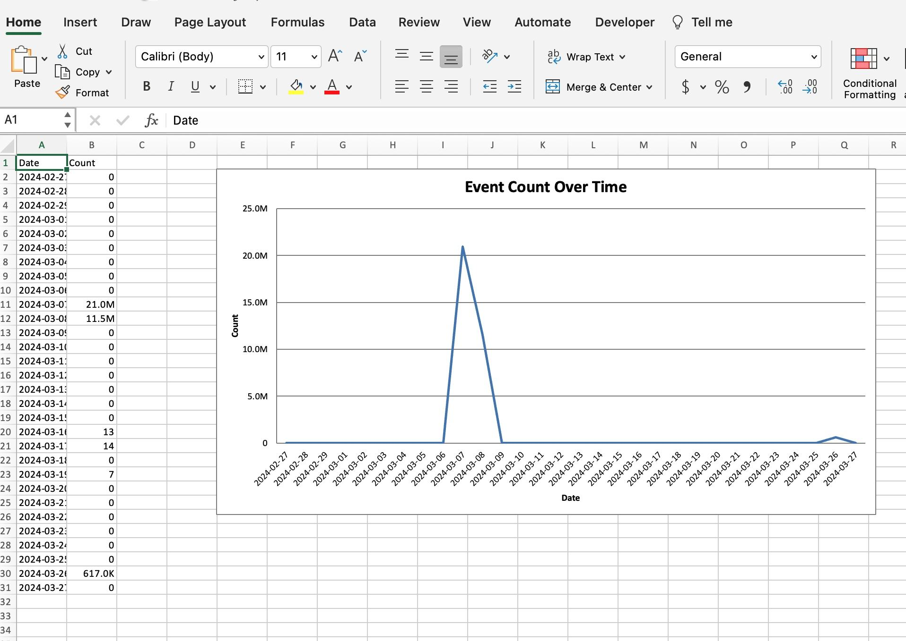

# query2excel

Simple python script to query LogZilla and export the results to an Excel file with a chart

# Setup

###

Install requirements:

```
pip3 install -r requirements.txt
```

copy env.sample to .env and edit to suit your environment.

```
cp env.sample .env
```

Sample `.env` file:

```
LOGZILLA_INSTANCE=http://logzilla.company.com
API_KEY=6160ce50a098067f31d1acc72396b31c4518a5ca7b178538
```

Run the script:

```
./query.py
```
This will write a file named `report.xlsx`

**Sample Excel output:**



## Debug

If you have trouble, try the `-d` option:
```
./query.py -d
```


